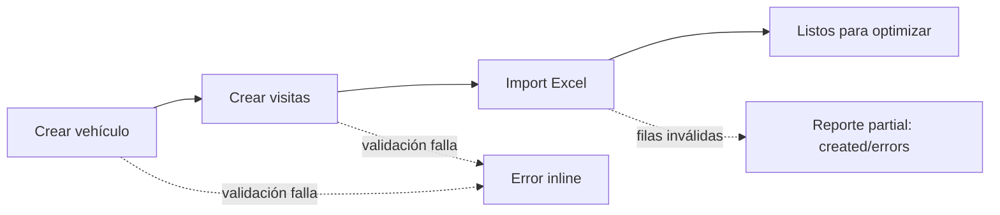
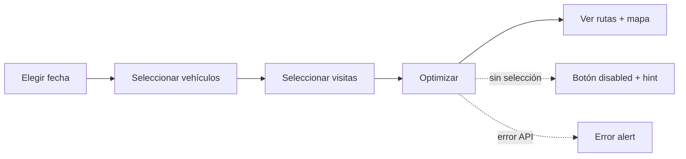
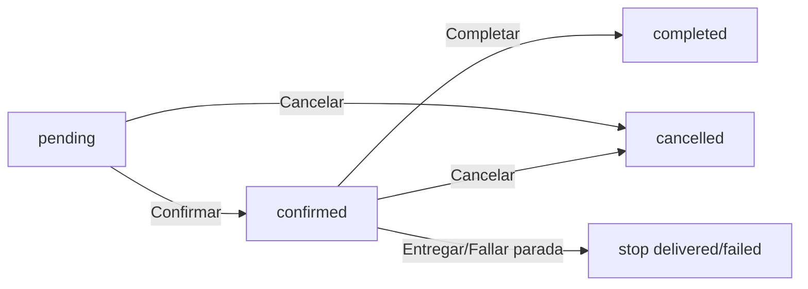
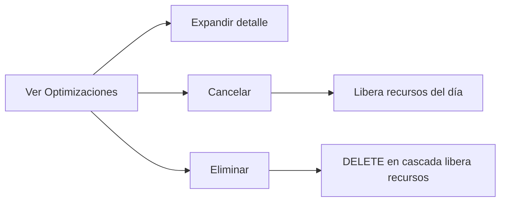
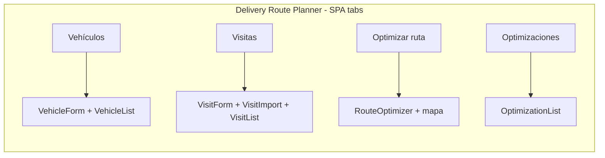

# User Journeys — Delivery Route Planner

> Discovery (reverse-engineering): rutas = pasos del journey. Generated: 2026-08-08 · Re-baselined: 2026-08-08 (journey de gestión de optimizaciones añadido).

## 1. Route Map

### Public Routes (Unauthenticated)

| Route | Page | Purpose |
|-------|------|---------|
| `/` (app root, tab "Vehículos") | `frontend/src/App.tsx:85-97` | CRUD vehículos: formulario + listado paginado/búsqueda |
| `/` (tab "Visitas") | `App.tsx:99-112` | CRUD visitas + import Excel + listado paginado/búsqueda |
| `/` (tab "Optimizar ruta") | `App.tsx:114` → `RouteOptimizer.tsx` | Planificador por fecha con mapa multi-ruta |
| `/` (tab "Optimizaciones") | `App.tsx:116` → `OptimizationList.tsx` | Listado/detalle/gestión de optimizaciones (añadido 2026-08-08) |

> SPA de una sola página con pestañas; no hay rutas URL distintas. Sin autenticación (AllowAny).

### Protected Routes (Authenticated)

Ninguna — no existe auth (`DEFAULT_PERMISSION_CLASSES = AllowAny`, Source: `backend/config/settings.py`).

### Dynamic Routes

| Pattern | Example | Purpose |
|---------|---------|---------|
| (ninguna — SPA con tabs, sin params de ruta) | — | — |

## 2. Journey 1 — Preparar el día: vehículos y visitas

- **Persona**: Operador Logístico · **Goal**: Dejar la flota y los destinos listos para optimizar · **Discovered From**: `VehicleForm.tsx`, `VisitForm.tsx`, `VisitImport.tsx`.

### Step-by-Step Flow

| Step | Page | Action | Next | Evidence (file:line) |
|------|------|--------|------|----------------------|
| 1 | Vehículos | Crear vehículo (nombre, capacidad kg/l, velocidad, depósito, jornada, almuerzo) | Se agrega a la lista | `VehicleForm.tsx`; `POST /api/vehicles/` (`api.ts:54-60`) |
| 2 | Visitas | Crear visita (nombre, dirección, lat/lng, servicio, prioridad, kg/l, ventana) | Se agrega a la lista | `VisitForm.tsx`; `POST /api/visits/` (`api.ts:70-76`) |
| 3 | Visitas | Importar Excel de visitas | Reporte `{created, errors[]}` | `VisitImport.tsx`; `POST /api/visits/import/` (`api.ts:82-86`) |

### Error Paths

| Error | Handling | Evidence |
|-------|----------|----------|
| Campo inválido (ej. `capacity_kg: -5`, lat fuera de rango) | 400 con mensajes de validación | BR-7 (domain-glossary); `backend/vehicles/models.py`, `backend/visits/models.py` |
| Fila Excel inválida | Registrada en `errors` sin abortar las válidas | `README.md` l85-86; BR-6 |
| Falla de red | `request()` lanza Error con detalle; App muestra `role="alert"` | `api.ts:16-33`; `App.tsx:83` |

### Success Criteria

- [ ] Vehículo visible en el listado tras crear.
- [ ] Visita visible en el listado tras crear o importar.
- [ ] Import reporta `created` + `errors` sin abortar.

## 3. Journey 2 — Optimizar la ruta del día

- **Persona**: Operador Logístico · **Goal**: Generar el plan del día optimizado · **Discovered From**: `RouteOptimizer.tsx`.

### Step-by-Step Flow

| Step | Page | Action | Next | Evidence (file:line) |
|------|------|--------|------|----------------------|
| 1 | Optimizar ruta | Elegir `date` (default hoy) | Carga `GET /api/available/resources/?date=` | `RouteOptimizer.tsx:50,59-73`; `api.ts:132-134` |
| 2 | Optimizar ruta | Checkboxs vehículos disponibles (default todos) | Estado `selectedVehicles` | `RouteOptimizer.tsx:134-148` |
| 3 | Optimizar ruta | Checkboxs visitas disponibles (default todas) | Estado `selectedVisits` | `RouteOptimizer.tsx:151-165` |
| 4 | Optimizar ruta | Click "Optimizar" (disabled si no hay ≥1 vehículo Y ≥1 visita) | `POST /api/optimizations/` `{date, vehicle_ids, visit_ids}` | `RouteOptimizer.tsx:75,168-173`; `api.ts:92-100` |
| 5 | Optimizar ruta | Revisar rutas optimizadas (métricas por vehículo) y warning de visitas no asignadas | Mapa multi-ruta con polylines + markers | `RouteOptimizer.tsx:209-243,282-288` |
| 6 | Optimizar ruta | Mapa encuadra la región (FitBounds) | — | `RouteOptimizer.tsx:36-47,245-276` (fix fitBounds 2026-08-08) |

### Error Paths

| Error | Handling | Evidence |
|-------|----------|----------|
| Ningún vehículo/visita disponible ese día | Hint "No hay vehículos/visitas disponibles ese día" | `RouteOptimizer.tsx:147,164` |
| Fecha sin recursos; sin selección | Botón disabled + hint "Selecciona al menos un vehículo y una visita" | `RouteOptimizer.tsx:75,171-173` |
| API error | `role="alert"` con detalle | `RouteOptimizer.tsx:176` |
| Visitas que no entran por capacidad | Warning "N visitas no fueron asignadas por falta de capacidad" | `RouteOptimizer.tsx:282-288` |

### Success Criteria

- [ ] `POST /api/optimizations/` responde 200 con optimización persistida (requiere `date` en payload — descubierto en re-baseline 2026-08-08).
- [ ] Mapa renderiza rutas y markers encuadrando todos los puntos.
- [ ] Visitas no asignadas se reportan.
- [ ] Re-fetch de disponibilidad tras optimizar (recursos quedan reservados).

## 4. Journey 3 — Ejecutar el plan (ciclo de vida y paradas)

- **Persona**: Supervisor de Operaciones · **Goal**: Confirmar el plan, ejecutarlo y resolver paradas · **Discovered From**: `RouteOptimizer.tsx:191-238`.

### Step-by-Step Flow

| Step | Page | Action | Next | Evidence (file:line) |
|------|------|--------|------|----------------------|
| 1 | Optimizar ruta | Confirmar (solo `pending`) | `POST /api/optimizations/{id}/confirm/` → `confirmed` | `RouteOptimizer.tsx:192-196`; `api.ts:106-108` |
| 2 | Optimizar ruta | Entregar/Fallar paradas (solo `confirmed` y stop `pending`) | `POST .../stops/{id}/deliver|fail/` | `RouteOptimizer.tsx:223-238`; `api.ts:122-130` |
| 3 | Optimizar ruta | Completar (solo `confirmed`) | `POST /api/optimizations/{id}/complete/` → `completed` | `RouteOptimizer.tsx:197-201`; `api.ts:110-112` |
| 4 | Optimizar ruta | Cancelar (solo `pending`/`confirmed`) | `POST /api/optimizations/{id}/cancel/` → `cancelled` | `RouteOptimizer.tsx:202-206`; `api.ts:114-116` |

### Error Paths

| Error | Handling | Evidence |
|-------|----------|----------|
| Transición no válida para el estado actual | Botones de acción ocultos según estado (no se ofrecen transiciones ilegales en UI) | `RouteOptimizer.tsx:191-207` |
| Resolver parada fuera de `confirmed` | Botones Entregar/Fallar solo se renderizan en `confirmed` | `RouteOptimizer.tsx:223` |
| API error en transición | `role="alert"` con detalle | `RouteOptimizer.tsx:104-113` |

### Success Criteria

- [ ] pending→confirmed→completed y pending/confirmed→cancelled son los únicos caminos ofrecidos.
- [ ] Parada `delivered`/`failed` se marca y no vuelve a `pending`.
- [ ] Estados de parada se muestran en la lista (Entregada/Fallida/Pendiente).

## 5. Journey 4 — Gestionar optimizaciones (listado, cancelar, eliminar)

- **Persona**: Supervisor de Operaciones · **Goal**: Ver todas las planificaciones y liberar recursos reservados · **Discovered From**: `OptimizationList.tsx` (feature añadida en re-baseline 2026-08-08).

### Step-by-Step Flow

| Step | Page | Action | Next | Evidence (file:line) |
|------|------|--------|------|----------------------|
| 1 | Optimizaciones | `GET /api/optimizations/` carga lista (id · fecha · estado · # rutas · # paradas) | Fila por optimización | `OptimizationList.tsx:30-45`; `api.ts:88-90` |
| 2 | Optimizaciones | Toggle "expandir" muestra rutas/paradas con métricas y horarios | Detalle expandido | `OptimizationList.tsx:115-138` |
| 3 | Optimizaciones | Click "Cancelar" (solo `pending`/`confirmed`) | `POST .../cancel/` + re-fetch | `OptimizationList.tsx:47-55,82`; `api.ts:114-116` |
| 4 | Optimizaciones | Click "Eliminar" (siempre disponible) | `DELETE /api/optimizations/{id}/` + re-fetch | `OptimizationList.tsx:57-65`; `api.ts:118-120` |

### Error Paths

| Error | Handling | Evidence |
|-------|----------|----------|
| Lista vacía | "No hay optimizaciones registradas." | `OptimizationList.tsx:73` |
| Error al cargar | `role="alert"` | `OptimizationList.tsx:36-37,71` |
| Error al cancelar/eliminar | `role="alert"` + no re-fetch | `OptimizationList.tsx:47-65` |

### Success Criteria

- [ ] Lista refleja las optimizaciones existentes con id, fecha, estado, conteos.
- [ ] Cancelar solo visible para `pending`/`confirmed`; eliminar siempre visible.
- [ ] Tras cancelar/eliminar, re-fetch actualiza la lista.
- [ ] Eliminar/cancelar libera vehículos y visitas reservados para esa fecha (verificado en vivo en re-baseline 2026-08-08).

## 6. Navigation Structure

> Sin autenticación, sin breadcrumbs, sin rutas URL dinámicas. Tabs gestionados por `tab` state en `App.tsx:12,17`.

## 7. Breadcrumb Patterns

N/A — SPA con tabs, sin breadcrumbs (Source: `App.tsx`).

## 8. Critical Paths

### Happy Paths (Must Work)

| Journey | Start | End | Business Impact |
|---------|-------|-----|-----------------|
| Preparar el día | Crear vehículo | Import Excel | Entrada de datos correcta habilita todo lo demás |
| Optimizar ruta | Elegir fecha | Ver rutas + mapa | Entregas del día planificadas y minimizadas |
| Ejecutar plan | Confirmar | Completar (resolviendo paradas) | Trazabilidad de ejecución |
| Gestionar optimizaciones | Listar | Cancelar/Eliminar | Control de recursos y planes existentes |

### Unhappy Paths (Must Handle)

| Scenario | Expected Behavior | Evidence |
|----------|-------------------|----------|
| Optimizar sin recursos disponibles | Hint en cada fieldset; sin call a la API | `RouteOptimizer.tsx:147,164` |
| Selección incompleta al optimizar | Botón disabled + hint | `RouteOptimizer.tsx:171-173` |
| Transición de estado ilegal | Botones ocultos por estado | `RouteOptimizer.tsx:191-207` |
| Eliminar optimización con recursos reservados | DELETE en cascada libera vehículos/visitas | `OptimizationList.tsx:57-65`; verificado 2026-08-08 |

## 9. Discovery Gaps

| Flow | Unknown | Question |
|------|---------|----------|
| Replanificación del mismo día | No soportada (deuda declarada) | ¿Se espera re-optimizar visitas fallidas? |
| Multi-vehículo/equipo | No hay jerarquías ni asignación por usuario | ¿Habrá roles reales en el futuro? |
| Ejecución real vs plan | No hay captura de km reales recorridos | ¿Se compara plan vs ejecución? |

## 10. QA Relevance

### Critical E2E Test Scenarios

| Priority | Scenario | Journey Reference |
|----------|----------|-------------------|
| P0 | Flujo completo: crear vehículo + visitas/import → optimizar → ver rutas + mapa | J1 + J2 |
| P0 | Confirmar plan → entregar/fallar paradas → completar | J3 |
| P0 | Disponibilidad: optimizar reserva recursos; cancelar/eliminar libera | J2 + J4 |
| P1 | Import Excel con filas inválidas → reporte parcial | J1 |
| P1 | Optimizar con selección parcial / sin recursos | J2 error paths |
| P1 | Gestión: listar/expandir/cancelar/eliminar optimizaciones | J4 |

### Suggested Test Data

| Journey | Test User | Prerequisites |
|---------|-----------|---------------|
| J1 | N/A (sin auth) | Datos base (vehículos/visitas) |
| J2 | N/A | ≥1 vehículo y ≥1 visita disponibles para la fecha |
| J3 | N/A | Optimización `pending`→`confirmed` con paradas `pending` |
| J4 | N/A | ≥2 optimizaciones con estados distintos (incl. una que reserve recursos) |

> Base de datos dev actual (re-baseline 2026-08-08): 10 vehículos / 120 visitas; optimizaciones residuales #1 (2026-08-09, pending), #2/#3 (cancelled). E2E usa `db.e2e.sqlite3` reseteada por corrida.
