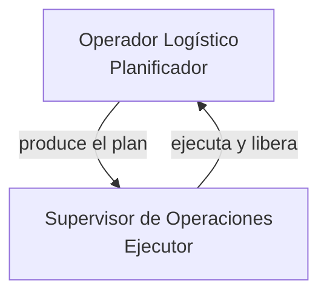

# User Personas — Delivery Route Planner

> Discovery (reverse-engineering): personas = roles que el sistema reconoce, no demografía inventada. Generated: 2026-08-08 · Re-baselined: 2026-08-08 (perfil Supervisor ampliado con gestión de optimizaciones).

## 1. Persona Discovery Summary

| Persona | System Role | Access Level | Primary Goal |
|---------|-------------|--------------|--------------|
| Operador Logístico (Planificador) | Configura flota + destinos, importa Excel, genera ruta del día | Total (API abierta, AllowAny) | Generar un plan del día optimizado y listo para confirmar |
| Supervisor de Operaciones (Ejecutor) | Confirma/completa/cancela planificaciones, resuelve paradas, monitorea optimizaciones | Total (API abierta, AllowAny) | Ejecutar y controlar el plan: liberar recursos y resolver entregas |

> Sin auth en el sistema: `DEFAULT_PERMISSION_CLASSES = AllowAny` (Source: `backend/config/settings.py`). Ambos perfiles usan la misma instancia sin login — los "roles" se distinguen por intención de uso, no por permisos.

## 2. Persona A — Operador Logístico (Planificador)

### Identity

- System Role: Configuración y planificación (sin rol de código; rol de intención).
- Evidence: `frontend/src/components/VehicleForm.tsx`, `VisitForm.tsx`, `VisitImport.tsx`, `RouteOptimizer.tsx`; `.context/product.md` §"Usuarios".
- Access Level: Full (API abierta).
- Estimated % of Users: ~50% (la mitad del flujo es entrada de datos + optimización).

### Goals (Inferred from Features)

| Goal | Supporting Feature | Route/Component |
|------|--------------------|-----------------|
| Registrar la flota con capacidad dual, jornada y almuerzo | CRUD Vehículos | `VehicleForm.tsx`; `POST /api/vehicles/` |
| Registrar destinos con coordenadas, carga y ventana horaria | CRUD Visitas | `VisitForm.tsx`; `POST /api/visits/` |
| Cargar muchos destinos de una vez | Import Excel | `VisitImport.tsx`; `POST /api/visits/import/` |
| Generar la ruta del día para una fecha dada | Optimización por fecha | `RouteOptimizer.tsx`; `POST /api/optimizations/` |

### Pain Points (Inferred from Validation/Errors)

| Pain Point | Evidence |
|-----------|----------|
| Entrada manual de cada visita es lenta — se mitiga con import Excel | `VisitImport.tsx`; `POST /api/visits/import/` reporta `{created, errors}` |
| Algunas visitas quedan fuera del plan por falta de capacidad | Warning "N visitas no fueron asignadas por falta de capacidad" — `RouteOptimizer.tsx:282-288` |
| El 400 al crear optimización si falta `date`/`vehicle_ids`/`visit_ids` | `CreateOptimizationPayload` en `frontend/src/types.ts`; `POST /api/optimizations/` |

### Feature Access

| Feature | Access | Evidence |
|---------|--------|----------|
| CRUD Vehículos | Full | `VehicleForm.tsx`, `VehicleList.tsx` |
| CRUD Visitas | Full | `VisitForm.tsx`, `VisitList.tsx` |
| Import Excel | Full | `VisitImport.tsx` |
| Optimización por fecha | Full | `RouteOptimizer.tsx` |
| Ciclo de vida (confirmar/completar/cancelar) | Full (vía el mismo optimizador) | `RouteOptimizer.tsx:191-207` |

### User Journey Summary

```
Flota + Destinos -> Import Excel -> Elegir día -> Seleccionar recursos -> Optimizar -> Revisar rutas + mapa
```

### Profile Attributes

- Sin modelo de usuario (sin auth). Atributos de interés: fecha de planificación, recursos seleccionados (vehicle_ids, visit_ids), métricas de ruta.

### Representative Quote (inferred)

> "Cargo los vehículos y las visitas del día, selecciono todo lo disponible y genero las rutas. Las visitas que no entren quedan señaladas."

## 3. Persona B — Supervisor de Operaciones (Ejecutor)

### Identity

- System Role: Ejecución y control de planificaciones (sin rol de código; rol de intención).
- Evidence: `RouteOptimizer.tsx:191-238` (confirm/complete/cancel + deliver/fail), `OptimizationList.tsx` (listado y gestión — añadido 2026-08-08).
- Access Level: Full (API abierta).
- Estimated % of Users: ~50% (la otra mitad del flujo es ejecución/monitoreo).

### Goals (Inferred from Features)

| Goal | Supporting Feature | Route/Component |
|------|--------------------|-----------------|
| Confirmar el plan del día (vehículos quedan reservados) | Transición pending→confirmed | `RouteOptimizer.tsx:192-196`; `POST /api/optimizations/{id}/confirm/` |
| Marcar entregas como entregadas/fallidas durante la jornada | Resolver paradas | `RouteOptimizer.tsx:223-238`; `POST /api/optimizations/{id}/stops/{id}/deliver|fail/` |
| Completar la planificación al cierre | Transición confirmed→completed | `RouteOptimizer.tsx:197-201`; `POST /api/optimizations/{id}/complete/` |
| Ver todas las optimizaciones existentes y su detalle | Listado/expansión de optimizaciones | `OptimizationList.tsx:79-138` |
| Cancelar/eliminar planes y liberar recursos reservados | Cancelar/Eliminar optimización | `OptimizationList.tsx:47-65`; `DELETE /api/optimizations/{id}/` |

### Pain Points (Inferred from Validation/Errors)

| Pain Point | Evidence |
|-----------|----------|
| Un plan confirmado bloquea vehículos y visitas; cancelarlo o eliminarlo es la única vía para liberarlos | Hint en `OptimizationList.tsx:75-77`: "Las optimizaciones reservan vehículos y visitas para su día. Cancela o elimina una para liberarlos." |
| Solo se pueden resolver paradas si la optimización está `confirmed` y la parada `pending` | Condición `result.status === 'confirmed' && stop.status === 'pending'` — `RouteOptimizer.tsx:223` |
| Las paradas `delivered` nunca se re-planifican (cuidado al marcar) | BR-5 en domain-glossary |

### Feature Access

| Feature | Access | Evidence |
|---------|--------|----------|
| Confirmar / Completar / Cancelar plan | Full | `RouteOptimizer.tsx:191-207` |
| Entregar / Fallar paradas | Full (solo en confirmed) | `RouteOptimizer.tsx:223-238` |
| Listar optimizaciones + detalle | Full | `OptimizationList.tsx` |
| Cancelar / Eliminar optimización | Full (cancelar solo pending/confirmed) | `OptimizationList.tsx:47-65,82` |

### User Journey Summary

```
Ver optimizaciones -> Expandir detalle -> Confirmar/ejecutar -> Resolver paradas -> Completar
```

### Profile Attributes

- Sin modelo de usuario (sin auth). Atributos de interés: estado de la optimización, estado de cada parada, recursos reservados.

### Representative Quote (inferred)

> "Necesito ver qué planificaciones existen, confirmar la del día, marcar las entregas y cancelar las que ya no aplican para liberar los vehículos."

## 4. Role Hierarchy



> Sin jerarquía de permisos (AllowAny). El grafo modela la relación de intención: el planificador produce la optimización que el supervisor ejecuta.

## 5. Permission Matrix

| Permission | Operador Logístico | Supervisor de Operaciones |
|------------|:------------------:|:-------------------------:|
| Crear vehículo / visita | ✅ | ✅ |
| Importar Excel | ✅ | ✅ |
| Crear optimización | ✅ | ✅ |
| Confirmar / Completar / Cancelar optimización | ✅ | ✅ |
| Entregar / Fallar paradas | ✅ | ✅ |
| Eliminar optimización | ✅ | ✅ |
| Autenticarse | ❌ (no existe) | ❌ (no existe) |

> Toda la API es abierta (AllowAny); no hay permisos diferenciados en el sistema actual.

## 6. Discovery Gaps

| Gap | Why It Matters | Question to Ask |
|-----|----------------|-----------------|
| Sin modelo de usuario ni roles | Personas son de intención, no de acceso; no hay restricciones que testear | ¿Se planea multi-usuario/roles? |
| No hay telemetría por persona | No se sabe quién planifica vs ejecuta | ¿Es el mismo rol en la práctica? |
| No hay `.env` keys por rol (`LOCAL_<ROLE>_EMAIL`) | Sin auth no hay cuentas de test | ¿Se requerirá login en el futuro? |

## 7. QA Relevance

### Test Account Requirements

| Persona | Test Account | Permissions Needed |
|---------|--------------|--------------------|
| Operador Logístico | Ninguno (API abierta) | N/A — no existe auth |
| Supervisor de Operaciones | Ninguno (API abierta) | N/A — no existe auth |

### Critical Persona Flows to Test

- Operador: crear vehículo → crear visitas/import → optimizar → revisar rutas/mapa.
- Supervisor: confirmar plan → entregar/fallar paradas → completar; listar/expandir/cancelar/eliminar optimizaciones; verificar liberación de recursos tras cancel/delete.

### Edge Cases by Persona

- Operador: optimizar sin vehículos/visitas disponibles (hint "No hay vehículos/visitas disponibles ese día"); selección parcial de recursos; visitas sin asignar por capacidad.
- Supervisor: resolver parada en optimización no `confirmed` (botón oculto); cancelar vs eliminar (delete siempre disponible, cancel solo pending/confirmed); eliminar libera recursos en cascada.
