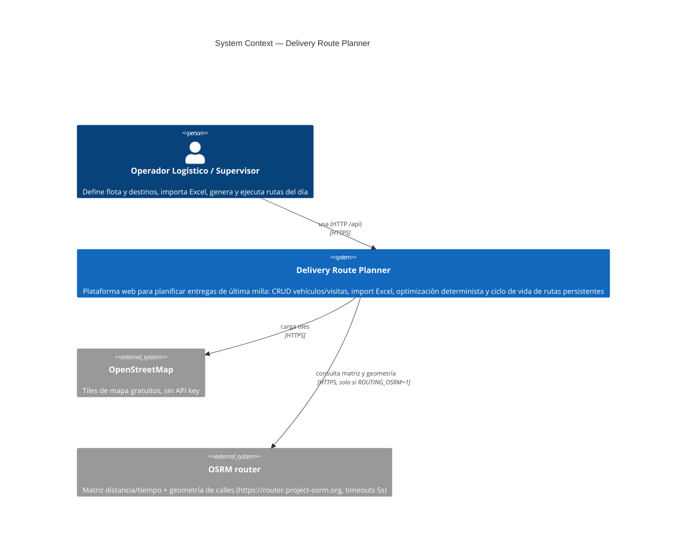
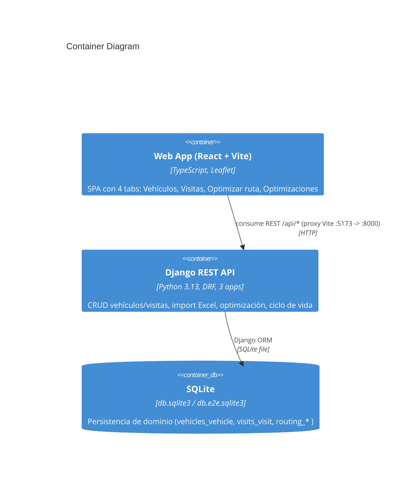
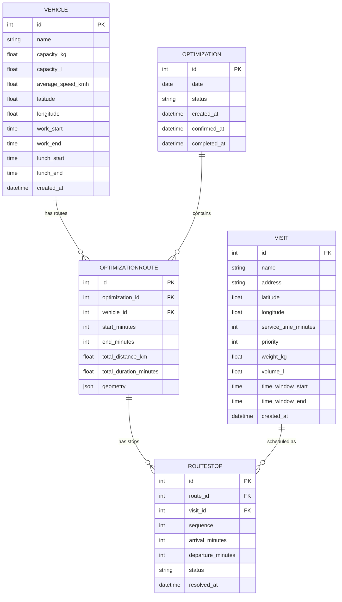
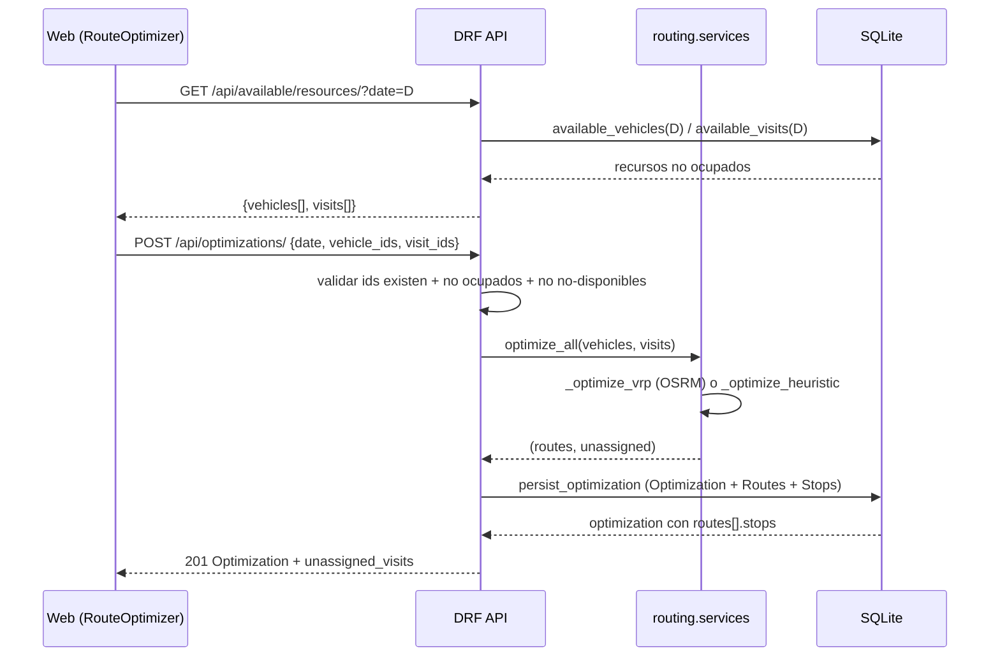

# Architecture Specs — Delivery Route Planner

> Discovery (reverse-engineering). Generated: 2026-08-08 · Re-baselined: 2026-08-08 (reflects OSRM/OR-Tools path + `geometry` field + feature "Optimizaciones").

## System Overview

| Aspect | Finding |
|--------|---------|
| Pattern | Monolito modular: un dominio logístico, `backend/` y `frontend/` desacoplados que se despliegan juntos |
| Backend | Django 5.2 LTS + Django REST Framework (Python 3.13), apps `vehicles`, `visits`, `routing` |
| Frontend | React 19 + Vite 8 + TypeScript + Leaflet/react-leaflet (OSM, sin API key) |
| DB | SQLite (dev: `db.sqlite3`; e2e: `db.e2e.sqlite3` vía `DJANGO_DB_NAME`) |
| Auth | Ninguna — `DEFAULT_AUTHENTICATION_CLASSES: []`, `AllowAny` |
| Optimizer | `routing/services.optimize_all`: heurística determinista, con path OSRM/OR-Tools activado por defecto (`ROUTING_OSRM=1`) y fallback heurístico |

Source: `backend/config/settings.py`; `frontend/src/App.tsx`; `project-config.md` §Tech Stack.

## C4 Context



## C4 Container



## Component Structure

```
backend/
  config/            # settings.py, urls.py, pagination.py, wsgi/asgi
  vehicles/          # model + serializers + views + urls (CRUD Vehicle)
  visits/            # model + serializers + views + urls + services (CRUD + import Excel)
  routing/           # models (Optimization/Route/Stop), services (optimize_all), views (ViewSet + available)
  scripts/           # generate_sample_xlsx.py, e2e_serve.py
frontend/
  src/
    components/      # VehicleForm, VehicleList, VisitForm, VisitImport, VisitList, RouteOptimizer, OptimizationList
    utils/geo.ts     # haversine, computeBounds, formatDistance, formatDuration
    api.ts           # capa HTTP (fetch wrapper)
    types.ts         # contratos TS del API
    App.tsx          # SPA con tabs
  e2e/               # Playwright (route.spec.ts)
```

| Component | Responsibility | Evidence |
|-----------|----------------|----------|
| `routing/services.optimize_all` | Optimización de flota completa (VRP) | `backend/routing/services.py:194-212` |
| `routing/views.OptimizationViewSet` | CRUD optimizaciones + transiciones de estado + resolver paradas | `backend/routing/views.py:15-135` |
| `routing/views.AvailableViewSet` | Disponibilidad de vehículos/visitas por fecha | `backend/routing/views.py:138-166` |
| `frontend/src/components/RouteOptimizer` | Planificador por fecha + mapa | `RouteOptimizer.tsx` |
| `frontend/src/components/OptimizationList` | Listado/gestión de optimizaciones (re-baseline 2026-08-08) | `OptimizationList.tsx` |

## Database Schema



### Table Detail

| Table | PK | FKs | Constraint/On-delete | Unique/Index |
|-------|----|-----|----------------------|--------------|
| `vehicles_vehicle` | `id` | — | validators: `capacity_kg/capacity_l ≥ 0`, `average_speed_kmh ≥ 0.1`, lat ∈ [-90,90], lon ∈ [-180,180] | ordering `["id"]` |
| `visits_visit` | `id` | — | validators: `service_time_minutes/priority ≥ 1`, `weight_kg/volume_l ≥ 0`, lat/lon ranges | ordering `["id"]` |
| `routing_optimization` | `id` | — | `status` TextChoices (pending/confirmed/completed/cancelled), default pending | ordering `["-created_at"]` |
| `routing_optimizationroute` | `id` | `optimization` (CASCADE, rel `routes`), `vehicle` (PROTECT, rel `optimization_routes`) | `geometry` JSONField nullable (migración 0002, re-baseline 2026-08-08) | ordering `["id"]` |
| `routing_routestop` | `id` | `route` (CASCADE, rel `stops`), `visit` (PROTECT, rel `route_stops`) | `status` TextChoices (pending/delivered/failed), `sequence` ≥ 1 | ordering `["sequence"]` |

Source: `backend/{vehicles,visits,routing}/models.py`.

## Data Flow

### Crear optimización (secuencia principal)



### Transiciones de estado (confirm / complete / cancel / deliver / fail)

```mermaid
sequenceDiagram
    participant U as Web
    participant A as OptimizationViewSet
    participant D as SQLite
    U->>A: POST /api/optimizations/{id}/confirm/
    A->>A: status == pending ? -> confirmed : 400
    A->>D: save(status, confirmed_at)
    A-->>U: 200 Optimization
    Note over U,A: complete exige confirmed; cancel exige pending|confirmed
    Note over U,A: deliver/fail exige confirmed y stop pending
```

Source: `backend/routing/views.py:67-135`.

## External Services

| Service | Purpose | Config | Integration Point |
|---------|---------|--------|-------------------|
| OpenStreetMap tiles | Render de mapa | Sin API key | `frontend/src/components/RouteOptimizer.tsx:252` (`TileLayer url=...openstreetmap.org`) |
| OSRM (`router.project-osrm.org`) | Matriz distancia/tiempo + geometría de calles | `ROUTING_OSRM=1` (default), `ROUTING_OSRM_URL`, `ROUTING_OSRM_TIMEOUT=5`, `ROUTING_OSRM_MAX_NODES=100` | `backend/routing/services.py:206-210` → `osrm.py`; solo si ≤100 nodos, timeout 5s, fallback heurístico |

> OR-Tools (`ortools==9.15.*`) presente en `requirements.txt`; usado por `vrp.solve` cuando el path OSRM está activo (Source: `backend/requirements.txt`, `backend/routing/services.py:238-260`).

## Security Architecture

| Aspect | Finding | Evidence |
|--------|---------|----------|
| Authentication | Ninguna (`DEFAULT_AUTHENTICATION_CLASSES: []`) | `settings.py:69` |
| Authorization | `AllowAny` para todo | `settings.py:70-72` |
| Secret handling | `SECRET_KEY` hardcodeada (dev) | `settings.py:24` (HIGH — risk-assessment #1) |
| DEBUG/ALLOWED_HOSTS | `DEBUG=True`, `ALLOWED_HOSTS=['*']` | `settings.py:27,29` (HIGH — risk-assessment #2) |
| CORS | `CORS_ALLOW_ALL_ORIGINS=True` | `settings.py:59` (MEDIUM — risk-assessment #3) |
| Middleware | Security, CORS, Session, CSRF, Auth, Messages, XFrameOptions | `settings.py:48-57` |
| Input validation | Django validators + DRF serializers | `vehicles/models.py`, `visits/models.py`, `routing/serializers.py` |
| Data-at-rest | SQLite sin cifrado (dev) | `settings.py:98-104` |

## Performance hooks

| Hook | Finding | Evidence |
|------|---------|----------|
| Cache | Ninguno (sin Redis/memoization) | grep backend/frontend |
| Rate limit | Ninguno | grep |
| Paginación | PageNumberPagination, page_size 10, max 100, param `page_size` | `config/pagination.py` |
| Query optimization | `prefetch_related("routes__stops__visit", "routes__vehicle")` en queryset | `routing/views.py:16` |
| Matriz OSRM | Solo si puntos ≤ `ROUTING_OSRM_MAX_NODES` (100); fallback haversine | `routing/services.py:244-251` |

## Discovery Gaps

- [ ] Formato exacto de `geometry` (estructura de la polilínea OSRM) no validado con datos reales.
- [ ] `MAILERS` dict en `settings.py:149` — typo probable de `EMAIL` (risk-assessment #8), sin uso.
- [ ] Sin OpenAPI spec publicado → contrato API no consumible por `bun run api:sync`; se recomienda `/business-api-map` post-discovery (SKILL §API contracts).
- [ ] Comportamiento de OSRM en red/fallos no cubierto por tests del SRS (fallback probado implícitamente por el try/except).
- [ ] Columnas duplicadas en import Excel: hoy gana la última (sin test que lo fije).

## QA Relevance

| Area | What to test | Notes |
|------|--------------|-------|
| `optimize_all` | Determinismo, capacidad dual, prioridad, ventanas, OSRM vs fallback | Unit: mockear `_optimize_vrp` para aislar heurística |
| Transiciones de estado | 400 en transición ilegal; timestamps `confirmed_at`/`completed_at`/`resolved_at` | API tests por endpoint |
| Disponibilidad | Reserva y liberación (cancel/delete) de recursos | Cubre feature Optimizaciones (re-baseline) |
| Mapa | Render polylines/markers; encuadre FitBounds | E2E con BD real reseteada |
| Página/API | Paginación + búsqueda (vehicles/visits) | Boundary en `page_size`/`page` |
