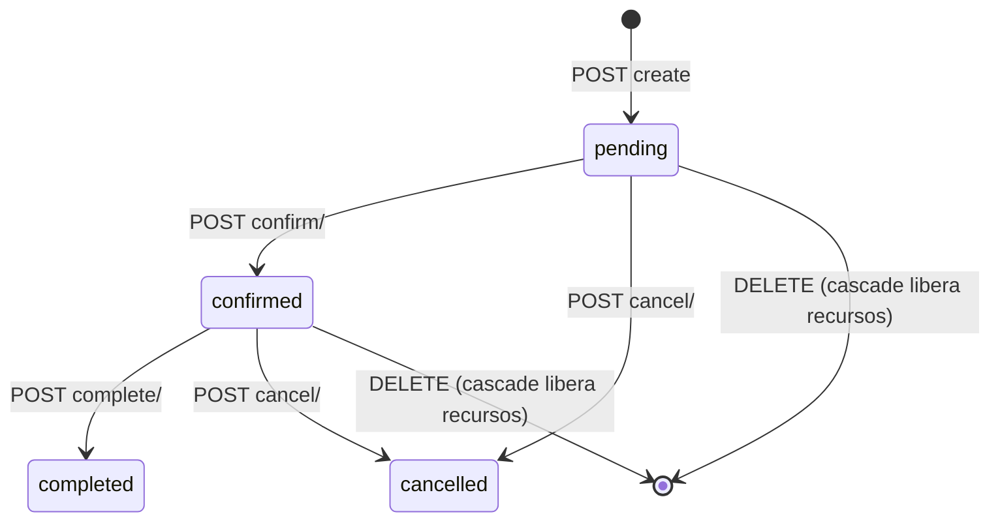
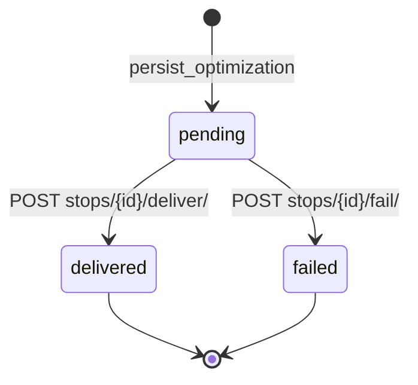

# Functional Specs — Delivery Route Planner

> Discovery (reverse-engineering). Generated: 2026-08-08 · Re-baselined: 2026-08-08 (FR-006 gestión de optimizaciones añadido; refleja `geometry` y path OSRM).

## Specification Index

| FR | Feature | Category | Priority |
|----|---------|----------|----------|
| FR-001 | CRUD Vehículos | Vehicles | P0 |
| FR-002 | CRUD Visitas | Visits | P0 |
| FR-003 | Import masivo Excel de visitas | Visits | P0 |
| FR-004 | Optimización por fecha (disponibilidad + planificación) | Routing | P0 |
| FR-005 | Ciclo de vida de optimización y paradas | Routing | P0 |
| FR-006 | Gestión de optimizaciones (listado, cancelar, eliminar) | Routing | P1 (re-baseline 2026-08-08) |

---

## FR-001: CRUD Vehículos

### Overview

| Aspect | Value |
|--------|-------|
| Feature | Crear, listar (paginado/búsqueda), eliminar vehículos |
| Related PRD | J1, personas Operador Logístico |
| Service/method | `vehicles/views.py` (ModelViewSet), `vehicles/models.py` |
| Evidence | `backend/vehicles/`; `frontend/src/components/VehicleForm.tsx`, `VehicleList.tsx` |

### Functional Requirement

El sistema permite registrar la flota: cada vehículo define capacidad dual (kg y litros), velocidad media, coordenadas de depósito, jornada laboral y almuerzo.

### Input Specification

| Field | Type | Required | Default | Constraints |
|-------|------|----------|---------|-------------|
| `name` | string(120) | sí | — | — |
| `capacity_kg` | float | no | 1000.0 | ≥ 0 |
| `capacity_l` | float | no | 1000.0 | ≥ 0 |
| `average_speed_kmh` | float | no | 40.0 | ≥ 0.1 |
| `latitude` | float | sí | — | ∈ [-90, 90] |
| `longitude` | float | sí | — | ∈ [-180, 180] |
| `work_start` | time | no | 08:00 | — |
| `work_end` | time | no | 18:00 | — |
| `lunch_start` | time | no | 13:00 | — |
| `lunch_end` | time | no | 14:00 | — |

### Validation Rules

```python
capacity_kg = FloatField(validators=[MinValueValidator(0)])
capacity_l = FloatField(validators=[MinValueValidator(0)])
average_speed_kmh = FloatField(validators=[MinValueValidator(0.1)])
latitude = FloatField(validators=[MinValueValidator(-90), MaxValueValidator(90)])
longitude = FloatField(validators=[MinValueValidator(-180), MaxValueValidator(180)])
```

Source: `backend/vehicles/models.py:8-29`.

### Processing Logic

1. `POST /api/vehicles/` valida con los validators del modelo.
2. Persiste la fila; `created_at` auto.
3. `GET /api/vehicles/?page=&page_size=&search=` lista paginada (page_size 10, max 100) con búsqueda por `name`.
4. `DELETE /api/vehicles/{id}/` elimina (PROTECT si tiene rutas — `OptimizationRoute.vehicle on_delete=PROTECT`).

### Output Specification

- Success: 201 (crear) / 200 con `Paginated<Vehicle>` (listar) / 204 (eliminar).
- Error: 400 con mensajes DRF de validación; 404 si no existe; 409/400 si PROTECT bloquea borrado con rutas.

### Business Rules

| BR | Rule | Found In |
|----|------|----------|
| BR-001 | Capacidad dual simultánea: una visita entra solo si no excede kg NI litros | `routing/services.py:50-54` (`_fits_capacity`); domain-glossary BR-1 |
| BR-007 | Validaciones de campo ≥ 0 y rangos lat/lon | `vehicles/models.py`; domain-glossary BR-7 |

### Edge Cases

| Case | Expected |
|------|----------|
| `capacity_kg: -5` | 400 con error de validación |
| `latitude: 100` | 400 fuera de rango |
| Eliminar vehículo con rutas persistentes | Bloqueado por PROTECT (400/409) |
| Búsqueda sin resultados | Lista vacía (`count: 0`) |

---

## FR-002: CRUD Visitas

### Overview

| Aspect | Value |
|--------|-------|
| Feature | Crear, listar (paginado/búsqueda), eliminar visitas |
| Related PRD | J1 |
| Service/method | `visits/views.py` (ModelViewSet), `visits/models.py` |
| Evidence | `backend/visits/`; `frontend/src/components/VisitForm.tsx`, `VisitList.tsx` |

### Functional Requirement

El sistema permite registrar destinos de entrega con coordenadas, carga física, prioridad y ventana horaria opcional.

### Input Specification

| Field | Type | Required | Default | Constraints |
|-------|------|----------|---------|-------------|
| `name` | string(120) | sí | — | — |
| `address` | string(255) | no | "" | — |
| `latitude` | float | sí | — | ∈ [-90, 90] |
| `longitude` | float | sí | — | ∈ [-180, 180] |
| `service_time_minutes` | int | no | 5 | ≥ 1 |
| `priority` | int | no | 1 | ≥ 1 (mayor = más importante) |
| `weight_kg` | float | no | 0.0 | ≥ 0 |
| `volume_l` | float | no | 0.0 | ≥ 0 |
| `time_window_start` | time \| null | no | null | — |
| `time_window_end` | time \| null | no | null | — |

### Validation Rules

```python
service_time_minutes = PositiveIntegerField(validators=[MinValueValidator(1)])
priority = PositiveIntegerField(validators=[MinValueValidator(1)])
weight_kg = FloatField(validators=[MinValueValidator(0)])
volume_l = FloatField(validators=[MinValueValidator(0)])
```

Source: `backend/visits/models.py:12-41`.

### Processing Logic

1. `POST /api/visits/` valida y persiste.
2. `GET /api/visits/?page=&page_size=&search=` paginado + búsqueda.
3. `DELETE /api/visits/{id}/` elimina (PROTECT si tiene paradas).

### Output Specification

- Success: 201 / 200 `Paginated<Visit>` / 204.
- Error: 400 validación; 404; PROTECT si tiene paradas.

### Business Rules

| BR | Rule | Found In |
|----|------|----------|
| BR-002 | Prioridad gobierna la selección cuando la capacidad es limitada | `routing/services.py:57-64` (`_select_visits`); domain-glossary BR-2 |
| BR-003 | Ventana horaria + jornada + almuerzo restringen la factibilidad | `routing/services.py:67-95` (`_arrival_if_feasible`); domain-glossary BR-3 |
| BR-005 | Visita entregada nunca re-planificada; fallida reintentable al día siguiente | `routing/services.py:297-329`; domain-glossary BR-5 |

### Edge Cases

| Case | Expected |
|------|----------|
| `service_time_minutes: 0` | 400 (≥ 1) |
| `weight_kg: -1` | 400 (≥ 0) |
| Ventana solo con `time_window_end` (start null) | Permitido; solo restringe cierre |
| Eliminar visita con paradas | Bloqueado por PROTECT |

---

## FR-003: Import masivo Excel de visitas

### Overview

| Aspect | Value |
|--------|-------|
| Feature | Carga masiva por Excel sin abortar filas inválidas |
| Related PRD | J1 |
| Service/method | `visits/services.py`, endpoint `POST /api/visits/import/` |
| Evidence | `backend/visits/views.py`; `frontend/src/components/VisitImport.tsx`; `README.md:70-86` |

### Functional Requirement

El sistema procesa un Excel (.xlsx/.xlsm) de visitas, crea las filas válidas y reporta las inválidas sin abortar el lote.

### Input Specification

| Field | Type | Notes |
|-------|------|-------|
| `file` | multipart | Columnas: `name,address,latitude,longitude,service_time_minutes,priority,weight_kg,volume_l` (primera fila = encabezados) |

### Validation Rules

- Fila en blanco → ignorada.
- Celda vacía en `service_time_minutes`/`priority`/`weight_kg`/`volume_l` → default.
- Fila inválida → `errors` sin abortar las válidas.
- Columnas duplicadas: gana la última (sin fijar por test — gap).

### Processing Logic

1. Parse del archivo; por cada fila validar campos.
2. Crear visitas válidas; acumular `errors` por fila inválida.
3. Responder `{"created": N, "errors": [{name, errors}]}`.

### Output Specification

- Success: 200/201 `ImportResult {created, errors[]}`.
- Error (archivo no soportado): 400.

### Business Rules

| BR | Rule | Found In |
|----|------|----------|
| BR-006 | Import sin abortar: válidas se crean, inválidas se reportan | `README.md:85-86`; domain-glossary BR-6 |

### Edge Cases

| Case | Expected |
|------|----------|
| 3 filas, 1 inválida | `created == 2`, `errors` contiene la fila |
| Filas en blanco | Ignoradas |
| `.csv` | No soportado (deuda) |

---

## FR-004: Optimización por fecha

### Overview

| Aspect | Value |
|--------|-------|
| Feature | Planificar rutas del día desde recursos disponibles |
| Related PRD | J2 |
| Service/method | `routing/services.optimize_all`, `routing/views.OptimizationViewSet.create`, `AvailableViewSet.resources` |
| Evidence | `backend/routing/services.py:194-260`; `backend/routing/views.py:20-65,138-166`; `RouteOptimizer.tsx` |

### Functional Requirement

El sistema permite elegir una fecha, ver los vehículos y visitas disponibles ese día y crear una optimización persistente que reparte las visitas entre los vehículos respetando capacidad dual, prioridad, ventanas horarias y jornada/almuerzo.

### Input Specification

| Field | Type | Required | Constraints |
|-------|------|----------|-------------|
| `date` | date | sí | YYYY-MM-DD |
| `vehicle_ids` | list[int] | sí | no vacío; ids existentes y no ocupados ese día |
| `visit_ids` | list[int] | sí | no vacío; ids existentes y disponibles ese día |

### Validation Rules

```python
date = serializers.DateField()
vehicle_ids = ListField(child=IntegerField(), allow_empty=False)
visit_ids = ListField(child=IntegerField(), allow_empty=False)
```

Source: `backend/routing/serializers.py:66-69`.

### Processing Logic

1. Validar ids existen; si no → 400 "Uno o más ids ... no existen."
2. Validar vehículos no ocupados el día (`busy_vehicle_ids`) → 400 "Vehículo(s) ocupado(s) ese día: ..."
3. Validar visitas disponibles (`unavailable_visit_ids`) → 400 "Visita(s) no disponibles ese día: ..."
4. `optimize_all`: si `ROUTING_OSRM=1` intenta `_optimize_vrp` (matriz OSRM si ≤100 nodos, geometría por calles); fallback `_optimize_heuristic` (asignación por prioridad + vecino más cercano).
5. `persist_optimization`: crea `Optimization` (status pending) + `OptimizationRoute` (métricas, geometry) + `RouteStop` (sequence, arrival/departure, status pending).
6. Devuelve 201 con `unassigned_visits` (visitas no asignadas por capacidad/horarios).

### Output Specification

- Success: 201 `Optimization` (id, date, status, routes[].stops, métricas) + `unassigned_visits`.
- Error: 400 (`date`/lists requeridos — payload sin `date` → 400; descubierto en re-baseline 2026-08-08), ids inexistentes, recursos ocupados/no disponibles.

### Business Rules

| BR | Rule | Found In |
|----|------|----------|
| BR-001 | Capacidad dual simultánea | `_fits_capacity` (`services.py:50-54`) |
| BR-002 | Prioridad gobierna selección | `_select_visits` (`services.py:57-64`) |
| BR-003 | Ventanas + jornada + almuerzo | `_arrival_if_feasible` (`services.py:67-95`) |
| BR-004 | Vehículo ocupado (pending/confirmed el día) no se ofrece | `busy_vehicle_ids` (`services.py:279-289`); domain-glossary BR-4 |
| BR-005 | Visita no disponible (entregada/fallida/planificada el día) no se ofrece | `unavailable_visit_ids` (`services.py:297-329`) |

### Edge Cases

| Case | Expected |
|------|----------|
| Sin vehículos | `routes: []`, todas las visitas en `unassigned_visits` |
| Fecha sin recursos disponibles | Fieldsets con hint; sin creación |
| Payload sin `date` | 400 (validación serializer) |
| Vehículo ocupado en `vehicle_ids` | 400 con nombres |
| Visita entregada en `visit_ids` | 400 con nombres |
| Visitas que no entran por capacidad | `unassigned_visits` poblado + warning UI |

---

## FR-005: Ciclo de vida de optimización y paradas

### Overview

| Aspect | Value |
|--------|-------|
| Feature | Transiciones de estado: confirm/complete/cancel; deliver/fail de paradas |
| Related PRD | J3 |
| Service/method | `OptimizationViewSet` actions |
| Evidence | `backend/routing/views.py:67-135`; `RouteOptimizer.tsx:191-238` |

### Functional Requirement

El sistema permite confirmar, completar y cancelar una optimización, y resolver paradas como entregadas o fallidas, aplicando guards de estado y timestamps.

### Input Specification

| Endpoint | Input |
|----------|-------|
| `POST /api/optimizations/{id}/confirm/` | — |
| `POST /api/optimizations/{id}/complete/` | — |
| `POST /api/optimizations/{id}/cancel/` | — |
| `POST /api/optimizations/{id}/stops/{stop_id}/deliver\|fail/` | — |

### Validation Rules (guards)

- confirm: status == `pending` → else 400 "Solo se puede confirmar una optimización pendiente."
- complete: status == `confirmed` → else 400 "Solo se puede completar una optimización confirmada."
- cancel: status in (`pending`, `confirmed`) → else 400 "Solo se puede cancelar una optimización pendiente o confirmada."
- deliver/fail: optimization status == `confirmed` → else 400 "Solo se pueden resolver paradas de una optimización confirmada."; stop existe en la optimización → else 400 "La parada solicitada no existe en esta optimización."; stop status == `pending` → else 400 "La parada ya fue resuelta."

### Processing Logic

1. Confirmar: `status→confirmed`, `confirmed_at=now`, save.
2. Completar: `status→completed`, `completed_at=now`, save.
3. Cancelar: `status→cancelled`, save.
4. Resolver parada: `status→delivered|failed`, `resolved_at=now`, save; re-fetch del detalle (evita cache).

### Output Specification

- Success: 200 con `Optimization` actualizado (paradas incluidas).
- Error: 400 con `detail`; 404 si el recurso no existe.

### Business Rules

| BR | Rule | Found In |
|----|------|----------|
| BR-004 | Ocupación de vehículos según status pending/confirmed | `busy_vehicle_ids` |
| BR-005 | Delivered nunca re-planificada; failed reintentable al día siguiente | `unavailable_visit_ids` |

### Edge Cases

| Case | Expected |
|------|----------|
| Confirmar una confirmada | 400 |
| Completar una pending | 400 |
| Cancelar una completed | 400 |
| Resolver parada de optimización no confirmed | 400 |
| Resolver parada ya resuelta | 400 |
| Resolver parada de otra optimización | 400 (no existe en esta) |

---

## FR-006: Gestión de optimizaciones (listado, cancelar, eliminar)

### Overview

| Aspect | Value |
|--------|-------|
| Feature | Listar todas las optimizaciones con detalle, cancelar y eliminar |
| Related PRD | J4 (re-baseline 2026-08-08) |
| Service/method | `OptimizationViewSet.list/destroy`, `GET/DELETE /api/optimizations/` |
| Evidence | `backend/routing/views.py:15-18`; `frontend/src/components/OptimizationList.tsx` |

### Functional Requirement

El sistema permite ver todas las planificaciones (id, fecha, estado, rutas y paradas con métricas/horarios), cancelar las pendientes/confirmadas y eliminar cualquier optimización, liberando los recursos reservados.

### Input Specification

| Endpoint | Input |
|----------|-------|
| `GET /api/optimizations/` | — (paginado) |
| `DELETE /api/optimizations/{id}/` | — |

### Validation Rules

- `http_method_names = ["get", "post", "delete", "head", "options"]` (sin PUT/PATCH).
- Delete: CASCADE en `OptimizationRoute.optimization` y `RouteStop.route` — libera recursos reservados.

### Processing Logic

1. `GET` lista optimizaciones (prefetch `routes__stops__visit`, `routes__vehicle`).
2. UI: por optimización, mostrar id · fecha · estado · N rutas · N paradas; expandir detalle por ruta (vehículo, distancia, duración, inicio/fin, paradas con estado).
3. Cancelar: `POST .../cancel/` (solo pending/confirmed — botón oculto si no).
4. Eliminar: `DELETE /api/optimizations/{id}/` (siempre disponible); CASCADE libera vehículos/visitas.

### Output Specification

- Success: 200 `Paginated<Optimization>` / 204 delete.
- Error: 400/404 según recurso; UI muestra `role="alert"`.

### Business Rules

| BR | Rule | Found In |
|----|------|----------|
| BR-004 | Cancelar libera vehículos/visitas del día | `busy_vehicle_ids` re-evalúa tras cancel |
| BR-005 | Eliminar libera en cascada | CASCADE models; verificado en vivo 2026-08-08 |

### Edge Cases

| Case | Expected |
|------|----------|
| Lista vacía | "No hay optimizaciones registradas." |
| Cancelar una completed desde UI | Botón no renderizado |
| Eliminar optimización con recursos reservados | Recursos liberados (verificado: 10 vehículos/120 visitas de nuevo disponibles) |
| Error al cancelar/eliminar | `role="alert"`, sin re-fetch |

---

## State Machines

### Optimization



| From | To | Trigger | Guard | Side Effects |
|------|----|---------|-------|--------------|
| pending | confirmed | `POST confirm/` | status == pending | `confirmed_at = now` |
| confirmed | completed | `POST complete/` | status == confirmed | `completed_at = now` |
| pending | cancelled | `POST cancel/` | status in (pending, confirmed) | — |
| confirmed | cancelled | `POST cancel/` | status in (pending, confirmed) | — |
| any | (deleted) | `DELETE` | — | CASCADE: routes + stops; libera recursos |

Source: `backend/routing/models.py:10-20`; `backend/routing/views.py:67-103`.

### RouteStop



| From | To | Trigger | Guard | Side Effects |
|------|----|---------|-------|--------------|
| pending | delivered | `POST deliver/` | optimization confirmed; stop pending | `resolved_at = now`; visita no re-planificable nunca |
| pending | failed | `POST fail/` | optimization confirmed; stop pending | `resolved_at = now`; reintentable desde el día siguiente |

Source: `backend/routing/models.py:54-65`; `backend/routing/views.py:105-135`.

---

## Business Rules Summary

| BR | Rule | FRs |
|----|------|-----|
| BR-001 | Capacidad dual simultánea (kg Y litros) | FR-001, FR-004 |
| BR-002 | Prioridad gobierna selección | FR-004 |
| BR-003 | Ventanas horarias + jornada + almuerzo | FR-004 |
| BR-004 | Vehículo ocupado (pending/confirmed) no se ofrece; cancel/delete libera | FR-004, FR-005, FR-006 |
| BR-005 | Delivered nunca re-planificada; failed al día siguiente; no disponible el mismo día | FR-002, FR-004, FR-005 |
| BR-006 | Import Excel sin abortar (created/errors) | FR-003 |
| BR-007 | Validaciones de campo ≥ 0 / rangos / ≥ 1 | FR-001, FR-002 |

## Validation Rules Catalog

| Entity | Field | Rules | Error |
|--------|-------|-------|-------|
| Vehicle | `capacity_kg`/`capacity_l` | ≥ 0 | 400 DRF |
| Vehicle | `average_speed_kmh` | ≥ 0.1 | 400 DRF |
| Vehicle | `latitude`/`longitude` | ∈ [-90,90] / [-180,180] | 400 DRF |
| Visit | `service_time_minutes`/`priority` | ≥ 1 | 400 DRF |
| Visit | `weight_kg`/`volume_l` | ≥ 0 | 400 DRF |
| Optimization | `date`, `vehicle_ids`, `visit_ids` | requeridos, listas no vacías | 400 serializer |
| Optimization | ids vehículo/visita | deben existir | 400 "Uno o más ids ... no existen." |
| Optimization | recursos | no ocupados/no disponibles el día | 400 "Vehículo(s) ocupado(s)..." / "Visita(s) no disponibles..." |

## Discovery Gaps

- [ ] Formato exacto de `geometry` (polilínea OSRM) no confirmado con datos reales.
- [ ] Protección de borrado con rutas/paradas (PROTECT) — el mensaje/status exacto del API no verificado en test.
- [ ] Columnas duplicadas del Excel (hoy gana la última) sin test fijado.
- [ ] Comportamiento de `ROUTING_OSRM` con red caída solo cubierto por try/except implícito; sin test dedicado del fallback (parcialmente cubierto por tests heurísticos existentes).
- [ ] Búsqueda de vehículos/visitas: campo(s) exacto(s) del `search` no verificados en este doc (DRF `SearchFilter` en `views.py` del target).

## QA Relevance

- Por cada FR: tests de happy path + boundary (EP/BVA en validators) + error path (400/404).
- FR-004: determinismo (misma entrada → misma salida), capacidad dual, prioridad, ventanas; mockear OSRM para aislar heurística.
- FR-005/006: state-transition por endpoint; verificar timestamps y liberación de recursos tras cancel/delete.
- FR-003: reporte parcial `{created, errors}`; archivo no soportado.
