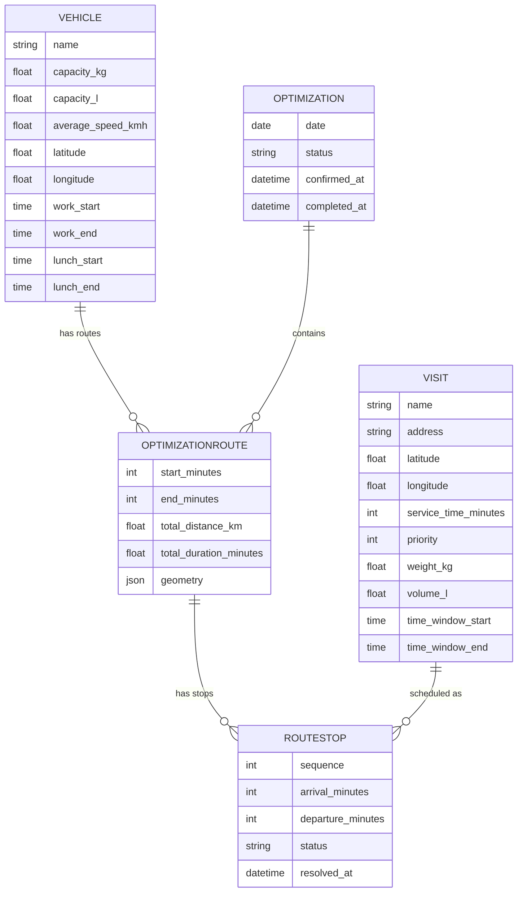
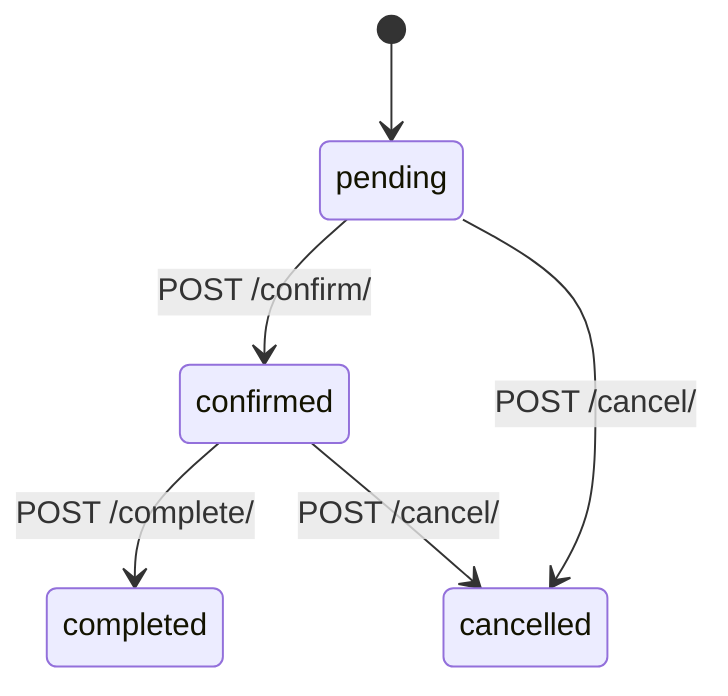
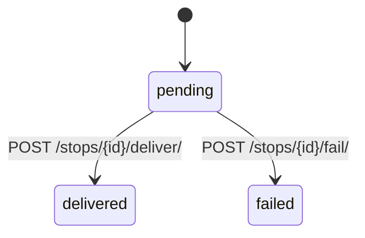

# Domain Glossary — route-optimizer (Delivery Route Planner)

> Generated: 2026-08-08 · Fuentes: `backend/{vehicles,visits,routing}/models.py`, `business/business-data-map.md`, `README.md`.

## 1. Core Entities

### Vehicle (Vehículo / Repartidor)

Technical Name | Business Name | Description | Table/Collection | Key Attributes | Found In
---|---|---|---|---|---
`Vehicle` | Vehículo / Repartidor | Unidad de la flota con capacidad dual, jornada, almuerzo y depósito | `vehicles_vehicle` | `name`, `capacity_kg`, `capacity_l`, `average_speed_kmh`, `latitude`, `longitude`, `work_start`, `work_end`, `lunch_start`, `lunch_end` | `backend/vehicles/models.py`

**Relationships**: Belongs to many `OptimizationRoute` (`optimization_routes`). The depot = its lat/lng (route origin).

**JSON example**:
```json
{
  "name": "Van 1",
  "capacity_kg": 1000.0,
  "capacity_l": 500.0,
  "average_speed_kmh": 40.0,
  "latitude": -33.45,
  "longitude": -70.66,
  "work_start": "08:00",
  "work_end": "18:00",
  "lunch_start": "13:00",
  "lunch_end": "14:00"
}
```

### Visit (Visita / Destino)

Technical Name | Business Name | Description | Table/Collection | Key Attributes | Found In
---|---|---|---|---|---
`Visit` | Visita / Destino de entrega | Destino con coordenadas, carga física, prioridad, ventana horaria opcional | `visits_visit` | `name`, `address`, `latitude`, `longitude`, `service_time_minutes`, `priority`, `weight_kg`, `volume_l`, `time_window_start`, `time_window_end` | `backend/visits/models.py`

**Relationships**: Belongs to many `RouteStop` (`route_stops`).

**JSON example**:
```json
{
  "name": "Cliente A",
  "address": "Av. Siempre Viva 123",
  "latitude": -33.44,
  "longitude": -70.65,
  "service_time_minutes": 5,
  "priority": 2,
  "weight_kg": 12.5,
  "volume_l": 30.0,
  "time_window_start": "09:00",
  "time_window_end": "12:00"
}
```

### Optimization (Optimización / Planificación del día)

Technical Name | Business Name | Description | Table/Collection | Key Attributes | Found In
---|---|---|---|---|---
`Optimization` | Planificación / Optimización del día | Conjunto de rutas para una fecha concreta, con ciclo de vida | `routing_optimization` | `date`, `status`, `created_at`, `confirmed_at`, `completed_at` | `backend/routing/models.py`

**Relationships**: Has many `OptimizationRoute` (`routes`).

### OptimizationRoute (Ruta planificada)

Technical Name | Business Name | Description | Table/Collection | Key Attributes | Found In
---|---|---|---|---|---
`OptimizationRoute` | Ruta de un vehículo | Ruta planificada de un vehículo dentro de una optimización, con métricas | `routing_optimizationroute` | `optimization`, `vehicle`, `start_minutes`, `end_minutes`, `total_distance_km`, `total_duration_minutes`, `geometry` | `backend/routing/models.py`

**Relationships**: Belongs to `Optimization`; Belongs to `Vehicle`; Has many `RouteStop` (`stops`).

### RouteStop (Parada planificada)

Technical Name | Business Name | Description | Table/Collection | Key Attributes | Found In
---|---|---|---|---|---
`RouteStop` | Parada / Entrega planificada | Entrega de una visita dentro de una ruta, con secuencia, horarios y estado | `routing_routestop` | `route`, `visit`, `sequence`, `arrival_minutes`, `departure_minutes`, `status`, `resolved_at` | `backend/routing/models.py`

**Relationships**: Belongs to `OptimizationRoute`; Belongs to `Visit`.

## 2. Enumerations and Constants

### Optimization.Status

| Value | Business Meaning | Usage Context |
|-------|------------------|---------------|
| `pending` | Planificación creada, sin confirmar | `Optimization.status` default |
| `confirmed` | Planificación confirmada (vehículos quedan ocupados) | `POST /api/optimizations/{id}/confirm/` |
| `completed` | Planificación completada | `POST /api/optimizations/{id}/complete/` |
| `cancelled` | Planificación cancelada | `POST /api/optimizations/{id}/cancel/` |

Found in: `backend/routing/models.py` (`Optimization.Status`).

### RouteStop.Status

| Value | Business Meaning | Usage Context |
|-------|------------------|---------------|
| `pending` | Parada planificada, sin resolver | `RouteStop.status` default |
| `delivered` | Visita entregada (nunca se re-planifica) | `POST /api/optimizations/{id}/stops/{stop_id}/deliver/` |
| `failed` | Entrega fallida (reintentable desde el día siguiente) | `POST /api/optimizations/{id}/stops/{stop_id}/fail/` |

Found in: `backend/routing/models.py` (`RouteStop.Status`).

## 3. Business Rules

### BR-1 — Capacidad dual (kg Y litros)

- Description: una visita entra a una ruta solo si su `weight_kg` no excede la capacidad restante del vehículo **en kg Y en litros**.
- Entities Affected: `Vehicle`, `Visit`, `OptimizationRoute`
- Validation: `_fits_capacity` en `routing/services.py`
- Error Message: (sin mensaje — la visita simplemente no se asigna, queda en `unassigned`)
- Found In: `business/business-data-map.md` §Narrativa de relaciones clave, `README.md` l14-18
- Given/When/Then: Given un vehículo con capacidad 100 kg / 200 L, when se intenta asignar una visita de 150 kg, then la visita queda en `unassigned_visits`.

### BR-2 — Prioridad gobierna la selección

- Description: las visitas de mayor `priority` se seleccionan primero cuando la capacidad es limitada (desempate `id` asc).
- Entities Affected: `Visit`, `OptimizationRoute`
- Validation: `_assign_visits` / `_select_visits`
- Error Message: —
- Found In: `business/business-data-map.md` §Flujo 3 (selección por prioridad)
- Given/When/Then: Given capacidad para 2 de 3 visitas con prioridad 3, 2, 1, when se optimiza, then entran las de prioridad 3 y 2.

### BR-3 — Ventana horaria y jornada

- Description: una parada se atiende dentro de su ventana; si se llega antes se espera; no se atiende tras `time_window_end`; se respeta `work_start`/`work_end` y el almuerzo del vehículo (se traslada a `lunch_end`).
- Entities Affected: `RouteStop`, `Vehicle`
- Validation: `_arrival_if_feasible`
- Error Message: —
- Found In: `business/business-data-map.md` §Flujo 3 (ventana horaria y jornada)
- Given/When/Then: Given una parada con ventana 09:00-10:00 y llegada estimada 09:30, when se optimiza, then la parada es factible (sin espera si ya pasó 09:00).

### BR-4 — Vehículo ocupado

- Description: un vehículo con ruta pending/confirmed el día no se ofrece como disponible.
- Entities Affected: `Vehicle`, `OptimizationRoute`
- Validation: endpoint `GET /api/available/resources/?date=...`
- Error Message: —
- Found In: `business/business-data-map.md` §Máquinas de estado (disponibilidad)
- Given/When/Then: Given un vehículo con ruta confirmed el 2026-08-10, when se consulta disponibilidad para esa fecha, then el vehículo no aparece.

### BR-5 — Disponibilidad de visitas

- Description: una visita entregada nunca se re-planifica; fallida se reintenta desde el día siguiente; con parada pending/confirmed el mismo día no se ofrece.
- Entities Affected: `Visit`, `RouteStop`
- Validation: disponibilidad en `routing/services.py`
- Error Message: —
- Found In: `business/business-data-map.md` §Máquinas de estado
- Given/When/Then: Given una visita con parada delivered, when se consulta disponibilidad cualquier día, then no se ofrece.

### BR-6 — Import Excel sin abortar

- Description: el import masivo procesa filas válidas y reporta las inválidas en `errors` sin abortar.
- Entities Affected: `Visit`
- Validation: `visits/services.py`, endpoint `POST /api/visits/import/`
- Error Message: `{"created": N, "errors": [{name, errors}]}`
- Found In: `README.md` l85-86, `business/business-data-map.md` §Flujo 2
- Given/When/Then: Given un Excel con 3 filas (1 inválida), when se importa, then `created == 2` y `errors` contiene la fila inválida.

### BR-7 — Validaciones de campo (via validators)

- Description: `capacity_kg`/`capacity_l`/`weight_kg`/`volume_l` ≥ 0; `average_speed_kmh` ≥ 0.1; `service_time_minutes`/`priority` ≥ 1; lat ∈ [-90,90]; lon ∈ [-180,180].
- Entities Affected: `Vehicle`, `Visit`
- Validation: Django `MinValueValidator`/`MaxValueValidator` en modelos
- Error Message: (mensajes DRF estándar)
- Found In: `backend/vehicles/models.py`, `backend/visits/models.py`
- Given/When/Then: Given un POST de vehículo con `capacity_kg: -5`, then 400 con error de validación.

## 4. Entity Relationships Diagram



## 5. Terminology Mapping

### Technical → Business

| Technical | Business |
|-----------|----------|
| `Vehicle` | Vehículo / Repartidor |
| `Visit` | Visita / Destino de entrega |
| `Optimization` | Planificación / Optimización del día |
| `OptimizationRoute` | Ruta planificada |
| `RouteStop` | Parada planificada |
| `delivered` | Entregada |
| `failed` | Fallida |
| `capacity_kg` / `capacity_l` | Capacidad dual (peso / volumen) |
| `pending/confirmed/completed/cancelled` | Pendiente / Confirmada / Completada / Cancelada |

### Abbreviations & acronyms

| Abbrev | Meaning |
|--------|---------|
| DRF | Django REST Framework |
| OSM | OpenStreetMap |
| lat / lng | Latitude / Longitude |
| kg / L | Kilogramos / Litros (capacidad dual) |
| E2E | End-to-end (Playwright) |
| TDD | Test-Driven Development |

## 6. Status / State Flows

### Optimization



### RouteStop



## 7. UI Labels Reference

> No i18n files exist; labels are hardcoded in component JSX. Derived from `frontend/src/` (App + components) — verify during Phase 3 if exact strings needed.

| UI Label (EN likely) | Meaning |
|----------------------|---------|
| Vehicles | Tab Vehículos |
| Visits | Tab Visitas |
| Optimize | Tab Optimizar (planificador) |
| Import | Acción importar Excel |

## 8. Discovery Gaps

- [ ] UI label strings exactas (es/en): no hay i18n; strings hardcodeados en JSX. Extraer en Phase 3 si QA los necesita.
- [ ] Formato exacto de `geometry` (polilínea): campo JSON documentado como `[lat, lon]`; confirmar estructura con datos reales.
- [ ] Reglas de import: columnas duplicadas (hoy gana la última) — verificar con tests/implementación.

## 9. QA Usage Guide

- Use `Vehicle`, `Visit`, `Optimization`, `OptimizationRoute`, `RouteStop` como vocabulario canónico para nombrar tests y casos (test-documentation, test-automation).
- Estado de `Optimization` y `RouteStop`: modelo de state-transition para diseñar casos por endpoint de transición.
- Reglas BR-1..BR-7: base para casos de boundary/equivalence en rutas e import.
- Las enumeraciones usan los valores de código (`pending`, `delivered`, etc.), no texto libre.
- Cualquier término nuevo detectado en el código → agregar aquí con su `Found In`.
