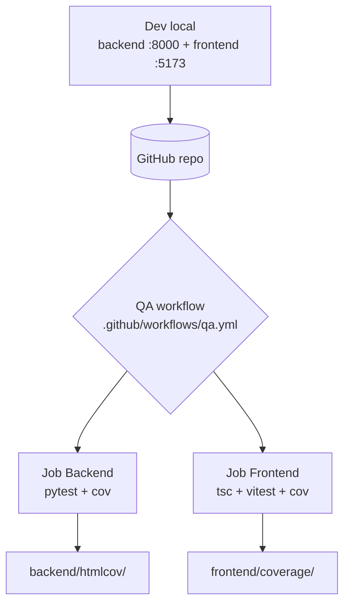
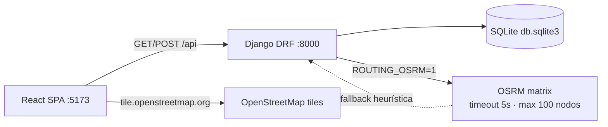

# Infrastructure — route-optimizer (Delivery Route Planner)

> Discovery (reverse-engineering). Generado: 2026-08-08 · Fase 3 Infrastructure Discovery. Read-only sobre el target; único write: `.context/infrastructure/`. Coherente con `.context/SRS/architecture.md` y `.context/infrastructure/{backend,frontend}.md`.

## Overview

**Estado clave**: el workflow QA está **diseñado pero nunca ejecutado** — el repo tiene 0 commits (todo untracked). No hay despliegue, ni staging/prod, ni IaC.

## CI/CD Configuration

### Plataforma: GitHub Actions

**Workflow único**: `.github/workflows/qa.yml` (nombre `QA`)

| Aspecto | Valor |
|---------|-------|
| Triggers | `push` a `main` + `pull_request` (cualquier PR) |
| Runner | `ubuntu-latest` (los 2 jobs) |
| Python | 3.13 (job backend) |
| Node | 20 (job frontend) |
| Caché | pip (backend), npm (frontend) |

### Jobs

| Job | Comandos | Gate | Artefactos |
|-----|----------|------|------------|
| **backend** | `pip install -r backend/requirements.txt` → `cd backend && python -m pytest` | cobertura ≥85% (`pytest.ini:5`) | `backend/htmlcov/` (upload `if: always()`) |
| **frontend** | `npm ci` → `npx tsc --noEmit` → `npx vitest run --coverage` | gates vitest (80/80/80/70) | `frontend/coverage/` (upload `if: always()`) |

> El job `e2e` (Playwright) fue **eliminado de `qa.yml` el 2026-08-08** — el E2E corre fuera del target, desde `agentic-qa-simpliroute`.

### Comandos CI vs comandos locales

- Los comandos de CI **coinciden** con los comandos documentados en `AGENTS.md` y `frontend/package.json` — sin drift.
- **Matiz**: CI NO corre `npm run build` (el `dist/` nunca se valida en pipeline). Gap registrado.

## Deployment Configuration

| Aspecto | Valor |
|---------|-------|
| Plataforma | **Ninguna** — sin `vercel.json`, `netlify.toml`, `fly.toml`, `Dockerfile` ni `docker-compose.yml` |
| Método de deploy | No definido. Proyecto de ejemplo / demostración, solo entorno local |
| Frontend prod | `API_BASE='/api'` relativo (`api.ts:14`) → requeriría reverse proxy o mismo origen en prod |

## Environments Matrix

| Environment | URL | Branch | Auto Deploy | Approval |
|-------------|-----|--------|-------------|----------|
| Development (local) | frontend `http://127.0.0.1:5173` · backend `http://127.0.0.1:8000` | local | — | — |
| QA | — | — | No existe | — |
| Staging | — | — | No existe | — |
| Production | — | — | No existe | — |

> Solo existe entorno local. qa/staging/prod = Discovery Gap (sin señales en el repo).

## Environment Variables by Environment

| Var | Local | QA | Staging | Prod |
|-----|-------|----|---------|------|
| `DJANGO_SETTINGS_MODULE` | `config.settings` | — | — | — |
| `DJANGO_DB_NAME` | `db.sqlite3` (dev) | — | — | — |
| `ROUTING_OSRM` | `1` (default) | — | — | — |
| `ROUTING_OSRM_URL` | (default local) | — | — | — |
| `ROUTING_OSRM_TIMEOUT` | 5 (s) | — | — | — |
| `ROUTING_OSRM_MAX_NODES` | 100 | — | — | — |

> `SECRET_KEY`, `DEBUG`, `ALLOWED_HOSTS`, `CORS_ALLOW_ALL_ORIGINS` están **hardcodeados en `settings.py`** (riesgos #1-3 de risk-assessment) — no hay env vars de configuración segura.
> Frontend: **cero** client env vars (`VITE_*`). No existe `.env.example` en ningún lado (gap).

## Secrets Management

| Secret | Storage | Access Scope | Estado |
|--------|---------|--------------|--------|
| `SECRET_KEY` (Django) | Hardcodeada en `settings.py:24` | Repo público | **RIESGO HIGH** — debe moverse a env var |

> No hay más secretos definidos. No se registran valores — solo la ubicación.

## Cloud Services

| Service | Provider | Purpose |
|---------|----------|---------|
| Ninguno | — | El proyecto es 100% local (sin servicios cloud) |

## Database Infrastructure

| Aspecto | Valor |
|---------|-------|
| Provider | SQLite (dev local) — `db.sqlite3` (el e2e usaba `db.e2e.sqlite3`; eliminado del target 2026-08-08) |
| Migrations | Django migrations (apps `vehicles`, `visits`, `routing`) |
| Seed | `python manage.py seed_demo` (10 vehículos / 120 visitas) |
| Region / Backups / Pooling | N/A — archivo local |

## Infrastructure Resources

## IaC

| Aspecto | Valor |
|---------|-------|
| Tool | **No presente** — sin Terraform/Pulumi/CDK/Serverless/Ansible |
| Estado | N/A |

## Monitoring & Observability

| Categoría | Estado |
|-----------|--------|
| Error tracking | No presente (sin Sentry/ Rollbar/ Bugsnag) |
| Uptime | No presente |
| Metrics/APM | No presente |
| Logging | Solo logging estándar Django (no hay shipping) |
| Health checks | Sin endpoint de health implementado (gap) |

## Deployment Checklist

- **Pre-deploy**: (n/a — no hay entorno de deploy)
- **Post-deploy**: (n/a)
- **Rollback**: (n/a)

> Todo el bloque es N/A hasta que el proyecto defina plataforma de hosting.

## Discovery Gaps

- [ ] Workflow QA (`qa.yml`) **nunca ejecutado** — repo con 0 commits; los gates de cobertura no están probados en CI real (y el job e2e fue removido del pipeline el 2026-08-08).
- [ ] Sin entorno de despliegue: qa/staging/prod inexistentes, sin plataforma (Vercel/Netlify/Docker/…).
- [ ] Sin `Dockerfile` / `docker-compose.yml` → sin contenedorización.
- [ ] Sin IaC, sin monitoring/observabilidad, sin health-check endpoint.
- [ ] Sin `.env.example` en backend ni frontend (el `.env` de QA del boilerplate es placeholder local).
- [ ] Secretos de configuración hardcodeados (`SECRET_KEY`, `DEBUG`, `ALLOWED_HOSTS`, `CORS`) → ver risk-assessment #1-3.
- [ ] Frontend sin client env vars; `API_BASE='/api'` relativo asume proxy/mismo origen en prod.
- [ ] CI no valida `npm run build` (el `dist/` no se construye en pipeline).

## QA Relevance

- **Integración de tests**: los 2 jobs de `qa.yml` definen dónde corren los tests QA (pytest/tsc/vitest) — el E2E se ejecuta desde `agentic-qa-simpliroute` (Playwright propio, target levantado manualmente). Una vez que el repo tenga su primer commit, QA obtiene regresión automatizada real.
- **Gaps que afectan a QA**: (1) sin CI ejecutado → los gates (85%/80%) son teoría hasta el primer push; (2) sin entorno qa/staging → QA solo puede testear local; (3) sin OpenAPI → contract derivado a mano (`/business-api-map` pendiente).
- **Recomendación**: primer commit + push a `main` para ejercitar `qa.yml` y validar que los gates pasan (cierra riesgo #4 de risk-assessment).
